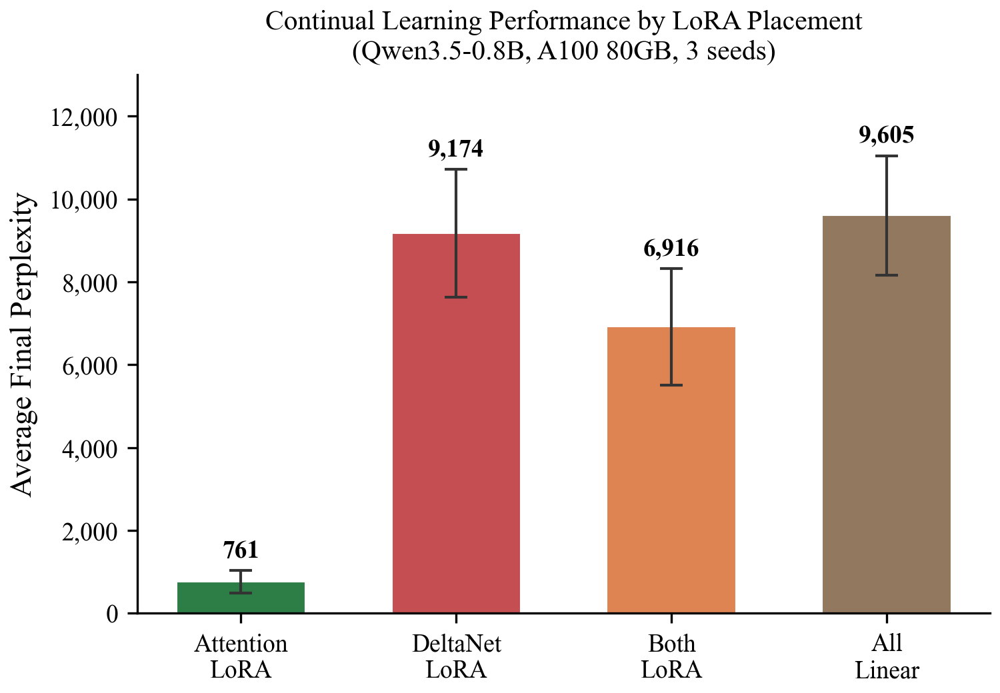
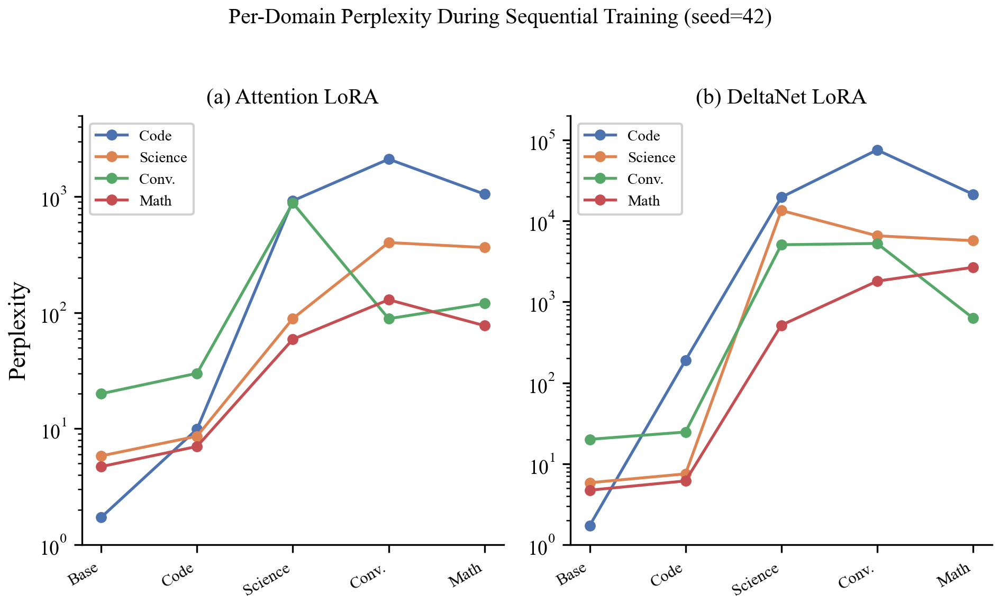
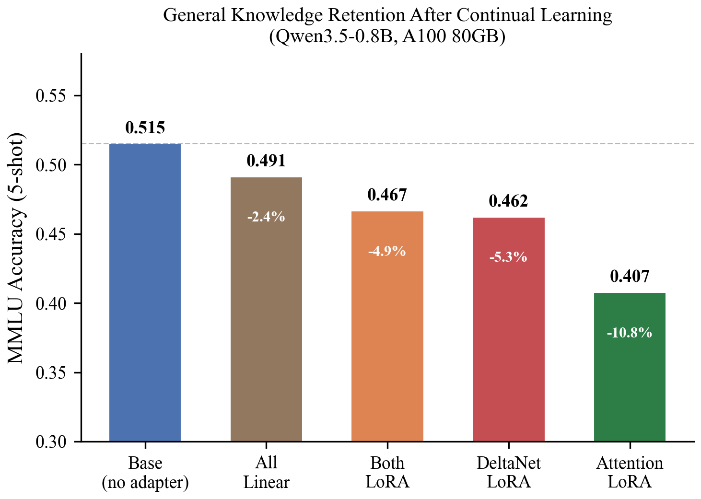
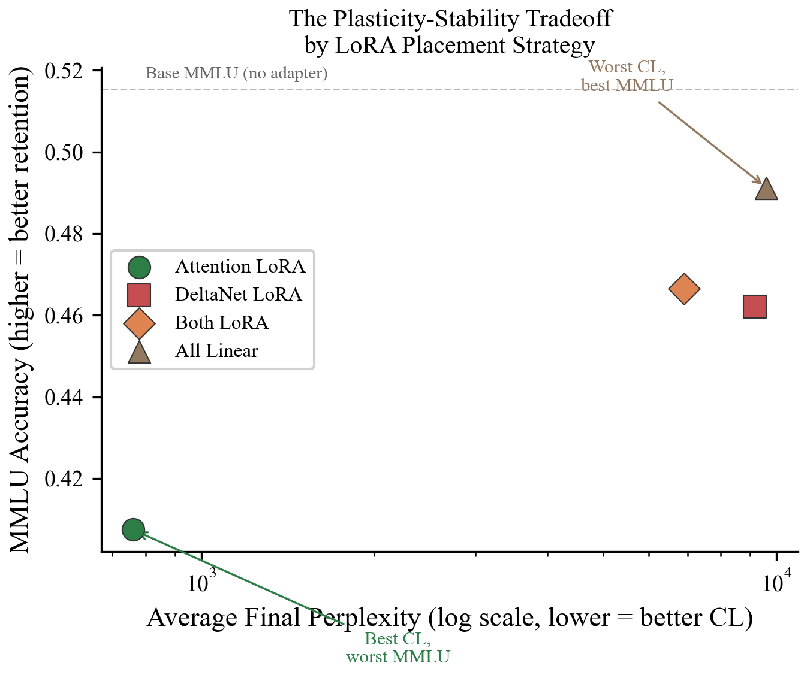

# Stop Tuning the Dynamics: LoRA Placement Determines Continual Learning Outcomes in Hybrid SSM-Attention Models

Research paper on where to place LoRA adapters when fine-tuning hybrid state-space-model + attention architectures (Qwen3.5, Jamba) for continual learning.

**Paper:** [`main.pdf`](main.pdf) · **LaTeX source:** [`main.tex`](main.tex)

## TL;DR

Hybrid architectures like Qwen3.5 (DeltaNet + attention) and Jamba (Mamba + attention) are increasingly common. When you LoRA-finetune them for continual learning across multiple domains, **which layer types should get adapters?**

We tested four strategies across two models, two hardware platforms, and three seeds:

1. **Attention-only** — LoRA on Q/K/V/O
2. **SSM-only** — LoRA on DeltaNet/Mamba projections
3. **Both**
4. **All-linear** (the standard baseline)

**Findings:**
- **Attention-only LoRA gives 9× lower perplexity** than the next-best strategy on the continual-learning task, with **5.6× fewer trainable parameters** than the all-linear baseline.
- **SSM-only LoRA fails catastrophically** at continual learning.
- But attention LoRA loses **10.8 percentage points** on MMLU — a plasticity-stability tradeoff that's localized to layer type.

SSM and attention layers appear to play fundamentally different roles in hybrid models. For continual learning, adapt the attention layers; for preserving general capability, don't.

## Experiments

**Models:**
- Qwen3.5-0.8B (12 DeltaNet + 12 attention layers)
- Jamba-Reasoning-3B (7:1 Mamba-to-attention ratio)

**Continual-learning protocol:** Train sequentially on four domains — Code (The Stack), Science (arXiv abstracts), Conversation (ShareGPT), Math (GSM8K) — evaluating perplexity on all four after each.

**Platforms:** Apple MLX (M-series) and NVIDIA CUDA (H100 via Modal), to rule out platform-specific artifacts.

**Evaluation:** Per-domain perplexity + MMLU for general-knowledge retention.

## Figures

| | |
|---|---|
|  |  |
| Main result: placement drives CL outcomes | Forgetting trajectory by layer target |
|  |  |
| MMLU retention vs placement | Plasticity-stability tradeoff |

## Reproducing the experiments

```bash
# Install
pip install modal torch transformers peft datasets

# Run on Modal (H100)
modal run modal_peft_paper.py --model qwen       # Qwen3.5-0.8B, ~30 min, ~$2
modal run modal_peft_paper.py --model jamba       # Jamba-3B, ~90 min, ~$6
```

Raw results land in `results/modal/`. Aggregated results in `results_cache/`.

To regenerate figures from the results:
```bash
python generate_figures.py
```

## Files

| Path | What it is |
|---|---|
| `main.tex`, `main.pdf` | The paper (NeurIPS 2023 preprint format) |
| `figures/` | 5 final figures |
| `neurips_2023.sty` | Style file |
| `modal_peft_paper.py` | Main experiment runner on Modal |
| `experiments/run_real_data.py` | Local/pod experiment variant |
| `experiments/setup_pod.sh` | Pod provisioning script |
| `generate_figures.py` | Regenerate figures from JSON results |
| `results/`, `results_cache/` | Experiment outputs (JSON) |
| `KEY_CITATIONS.md` | Citations with notes |
| `peft-hybrid-paper-arxiv-*.tar.gz` | Arxiv submission bundle |

## Citation

If this work is useful to you:

```bibtex
@misc{gouru2026lora_placement,
  title   = {Stop Tuning the Dynamics: LoRA Placement Determines Continual Learning Outcomes in Hybrid SSM-Attention Models},
  author  = {Gouru, Sri Harsha},
  year    = {2026},
  note    = {arXiv preprint}
}
```

## Status

Paper complete and packaged for arXiv submission. This repo is the working directory; the arXiv bundle is `peft-hybrid-paper-arxiv-20260318.tar.gz`.

## License

Code: MIT. Paper text: CC-BY-4.0.
